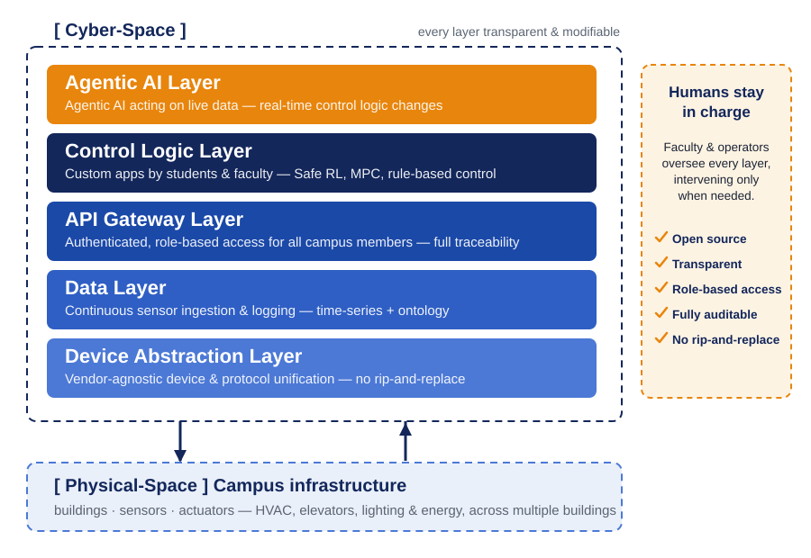

# Architecture: the five-layer open smart building platform

  

## Design principles

1. **Transparent and modifiable at every layer.** Conventional building operating systems hide everything. Here, every layer can be observed, analyzed, and extended by authorized campus members. The black box dissolves.
2. **No rip-and-replace.** The platform wraps existing vendor systems rather than replacing them. Institutions keep their current building management investments.
3. **Safe, authenticated access.** Developers get real access to real infrastructure — through authenticated, role-based, fully traceable APIs, never raw device credentials.
4. **Human-on-the-loop oversight.** Operators and faculty can monitor every layer and intervene when needed. Crucially, the equipment's native physical controls always take precedence over API operations: even if an application misbehaves, control can be safely reclaimed on the spot.

## The layers

### 1. Device Abstraction Layer
Unifies heterogeneous vendor devices and protocols behind a common interface. Integration is done per building: for each facility, control paths for HVAC, ventilation, and other equipment are worked out with the building's facility managers, and adapter APIs are designed against the central monitoring systems accordingly. Legacy building equipment, modern IoT sensors, and custom-built devices all appear as uniform resources. This is the layer that makes the platform vendor-agnostic and transferable.

### 2. Data Layer
Continuous ingestion and logging of sensor data across campus buildings. Time-series storage plus an ontology that gives the data meaning: which sensor, in which room, in which building, measuring what.

### 3. API Gateway Layer
The single, authenticated entry point for every read and write. Authentication is federated with the university's existing accounts; authorization is role-based for all campus members, with full traceability of who did what, when. See [api-gateway.md](api-gateway.md).

### 4. Control Logic Layer
Where custom applications are deployed: Safe RL, MPC, and rule-based control, plus arbitrary applications built against the Gateway APIs. Safety constraints bound what any application can do to the physical plant.

### 5. Agentic AI Layer
Agentic AI acting on live data — real-time control logic changes, energy optimization, and occupancy-aware environment control. Because the layers below are open, developers can observe which sensors an agent reads and why it acts — behavior that stays hidden in conventional building OSs.

## Physical deployment

The platform currently runs across multiple buildings on the UEC campus (Tokyo), including lecture, library, and research facilities, connected to a secure campus sensor network (including a LoRa network independent of the campus LAN for low-power sensors).

<!-- TBD: 公開して差し支えなければ建物数・センサー数などの規模感を追記 -->

## Transferability

The architecture is intentionally minimal in its assumptions: any institution with existing building systems and a campus network can, in principle, reproduce the stack. The practical work of adoption is less about code than about integration and governance — designing the per-building adapters with facility managers, binding the Gateway to the institution's identity system, and agreeing on access policies and audit responsibilities. The staged open-source release ([ROADMAP.md](../ROADMAP.md)) starts with the layers that are most reusable across institutions.
